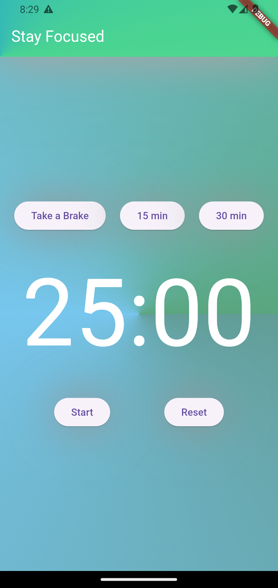

# Pomodoro App

This application is designed to enhance productivity using the Pomodoro Technique. It is especially beneficial for individuals with Attention Deficit Hyperactivity Disorder (ADHD), providing a structured approach to manage focus and work effectively.

## Features

- **Timer Control:** Set work and break intervals with easy-to-use buttons.
- **Countdown Display:** View the remaining time for the current work or break period.
- **Start/Stop:** Begin or pause the timer as needed.
- **Reset:** Reset the timer to start fresh.
- **Exit Warning:** Receive alerts when attempting to exit the app while the timer is running, ensuring you complete your work intervals without interruption.

## Why Use the Pomodoro Technique?

The Pomodoro Technique helps break work into short, manageable intervals (usually 25 minutes), separated by short breaks. This method helps maintain focus and reduce mental fatigue, making it an excellent tool for anyone, especially those with ADHD, who may struggle with time management and sustaining attention.

### Benefits for ADHD

1. **Structured Work:** Breaking tasks into smaller increments makes them less overwhelming and helps maintain concentration.
2. **Time Awareness:** The ticking timer raises awareness of the passing time, aiding in better time management.
3. **Motivation:** Short-term goals keep users motivated and focused, combating procrastination and impulsivity.
4. **Preventing Burnout:** Regular breaks help prevent mental fatigue and burnout.

## Usage

1. **Set the Duration:**

   - Click the "15 min" or "30 min" buttons for preset work intervals.
   - Use the duration selector for custom time settings.

2. **Start the Timer:**

   - Click the "Start" button to begin the work interval.
   - The countdown display shows the remaining time.

3. **Take a Break:**

   - Click the "Take a Break" button for break intervals.
   - Follow the timer's prompts to maintain the work-break cycle.

4. **Reset:**

   - Click the "Reset" button to restart the timer from zero.

5. **Exit Warning:**
   - If you attempt to exit the app before the timer ends, you will receive a warning message. The app does not allow exiting before the time is up to help maintain focus and discipline.

## Simplicity for Focus

The app's simple design minimizes distractions, allowing users, particularly those with ADHD, to focus on their tasks and manage their work intervals effectively. The absence of a pause button ensures that users stay committed to their work periods without interruptions.

## Screenshots and QR Code for APK

  
  

## Contribution

We welcome contributions to improve the app. Please submit a pull request or open an issue with your suggestions.

## License

This project is licensed under the MIT License. For more details, see the [LICENSE](LICENSE) file.

## References

This application was inspired by discussions on ADHD and productivity, including insights shared by developers with ADHD on platforms such as Stack Overflow, and techniques recommended by professionals for managing ADHD, such as the Pomodoro Technique. For more information, see:

- ["What developers with ADHD want you to know"](https://stackoverflow.blog/2023/03/10/what-developers-with-adhd-want-you-to-know/)
- ["Pomodoro Technique for ADHD: Why it Helps & How to Begin"](https://www.choosingtherapy.com/pomodoro-technique-adhd/)
